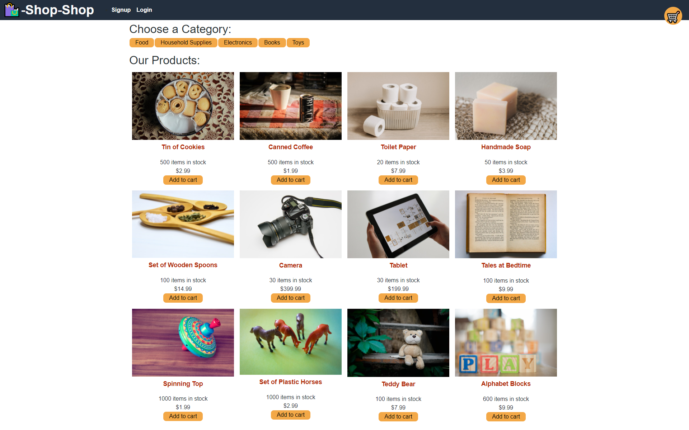
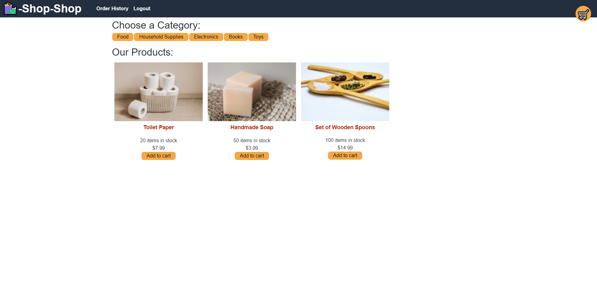
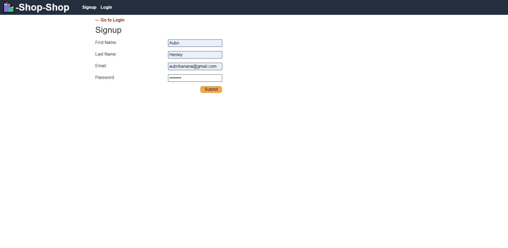
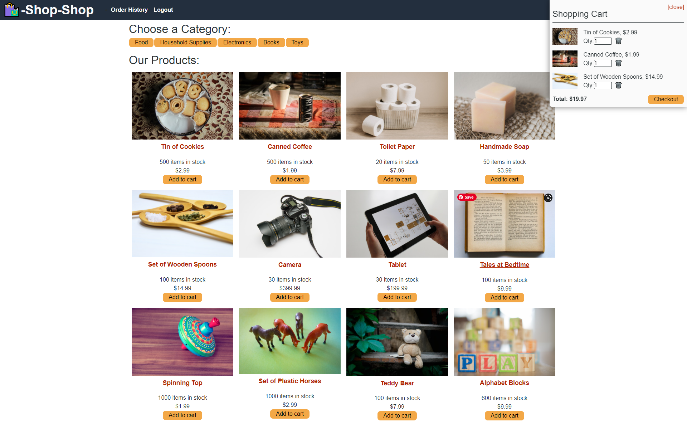

# Redux-Store# Redux-Store


[View the Store](https://git.heroku.com/floating-lowlands-52369.git)

---
[](https://opensource.org/licenses/MIT)

## Table of Contents:
- [Description](#description)
- [Installation](#installation)
- [Technologies](#technologies)
- [Usage](#usage)
- [Testing](#testing)
- [Additional-Info](#additional-info)

---

## Description:

This application has been refactored to use Redux. The online shopping store is linked to Stripe to allow for credit card purchases.

## Technologies:
```
- Javascript
- Node
- Mongo DB
- Mongoose
- Express
- MongoAtlas
- Graphql
- Apollo
- Redux
```

---

## Installation: 

To use this app, first one must clone the repo. Once, cloned, open the code in their coding platform of choice. Then open an integrated terminal at the root directory of the project and run `npm i`. This will install all the dependencies needed for the application to run correctly. 


```
npm i
npm run seed
npm run develop
```

---

## Usage: 

The user is able to shop an online store. The user will be able to browse all the products, or filter by specific category. The user can add items to their cart. The user cannot check out unless they either create an account or login to their existing account. Once the user signs up or logs in to their account they can then purchase what they have added to their cart via a Stripe connection.

---






---

## Testing:

Testing files were provided with original code.

---

## Additional Info:
- Github: [Aubri Henley](https://github.com/aubrihenley)
- Email: aubri.henley@gmail.com